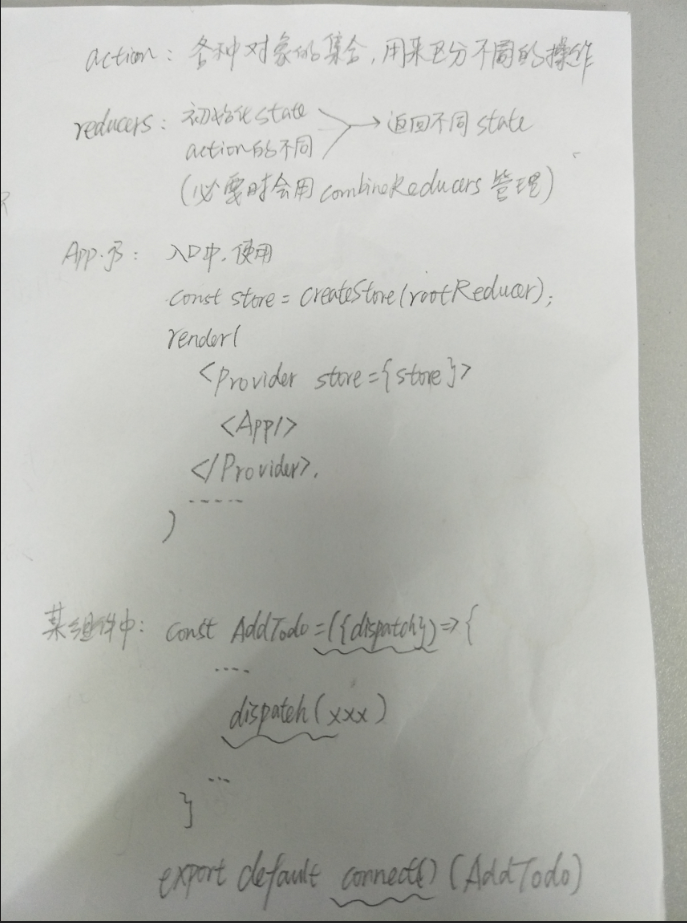

yarn
yarn start

1、router参考文档：https://reacttraining.com/react-router/web/guides/quick-start，建议放大观看

2、应用功能：使用 router-redux-antd-antv 搭建一个 可以切换语言的单页面应用

3、redux的基本使用：

4、react的搭建：

5、了解antv的基本使用方法，使用他的柱状图并与用户进行交互

6、引用echarts做个准备

7、引入antd-mobile，认清 
TabBar（可以当做大导航条）、
Grid（九宫格）、
ActionSheet（活动面板，操作后出现屏幕下方长出来的弹窗）、
ActivityIndicator（活动指示器，类似loading）、
PullToRefresh（拉动刷新）、
SwipeAction（滑动操作）
等几个手机页面常见的 而web不怎么用到的或命名差异很大的 组件
参考文章：https://mobile.ant.design/components/tab-bar-cn/

手机端有几种操作呢？

// 2、弄清楚web端的九宫格
// 4、ref在17版本以后还能不能用
// 5、使用css点击元素后消失
// 6、保证tabbar的位置靠下方